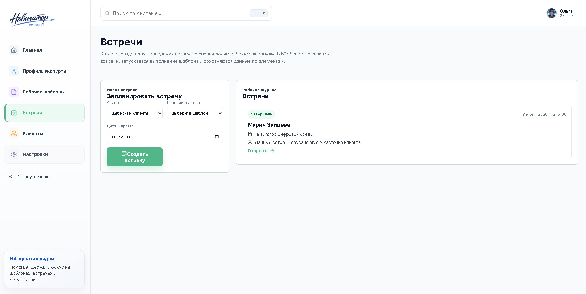

# Навигатор решений

  

## О проекте

Навигатор решений — интеллектуальное рабочее место эксперта.

Система помогает переводить профессиональный опыт в цифровые сценарии работы с клиентами, проводить встречи по единым стандартам, сохранять результаты взаимодействия и постепенно формировать собственную базу знаний и методик.

Проект разработан как универсальная среда для консультантов, коучей, наставников, психологов, бизнес-экспертов и других специалистов, работающих через встречи и сопровождение клиентов.

---

## Статус проекта

| Компонент | Статус |
|------------|---------|
| Интерфейс MVP | ✅ Реализован |
| Профиль эксперта | ✅ Реализован |
| Рабочие шаблоны встреч | ✅ Реализованы |
| Клиенты | ✅ Реализованы |
| Встречи | ✅ Реализованы |
| Настройки ИИ-куратора | ✅ Реализованы |
| Локальная база данных | ✅ Реализована |
| ИИ-контур | ⚙ Спроектирован |
| Gemma 4 через Ollama | ⚠ Требует доработки |

---

## Технологический стек

  
  
  
  
  
  
  

---

## Основные возможности MVP

- Профиль эксперта
- Рабочие шаблоны встреч
- Клиентская база
- История взаимодействия
- Проведение встреч по шаблонам
- Настройки ИИ-куратора
- Подготовка архитектуры ИИ-контура

---

## Интерфейс системы

### Главный экран

### Профиль эксперта

Базовое состояние профиля эксперта.

Режим взаимодействия с ИИ-куратором.

### Рабочие шаблоны

Список созданных шаблонов встреч.

Режим создания структуры встречи через ИИ-куратора.

### Клиенты

Список клиентов и рабочий контекст.

Карточка клиента и история взаимодействия.

### Встречи

Список встреч.

Рабочее пространство проведения встречи.

### Настройки

Настройка поведения ИИ-куратора и локального ИИ-контура.

---

## ИИ-контур

В рамках MVP подготовлена архитектура локального ИИ-контура.

Для локального запуска была выбрана связка Ollama + Gemma 4.

На момент сдачи проекта интерфейс и архитектура системы полностью реализованы, однако запуск локальной модели требует дополнительной настройки из-за ошибки загрузки модели Gemma через Ollama.

ИИ-контур является следующим этапом развития проекта.

---

## Планы развития

- Подключение локального ИИ-контура
- Автоматическая подготовка к встречам
- Анализ клиентских данных
- Формирование итоговых материалов
- Генерация рекомендаций
- Накопление и развитие экспертной базы знаний
- Аналитика эффективности методик

---

## Автор проекта

Ольга Тукмачева

Выпускной проект курса по вайб-кодингу и проектированию ИИ-систем.
