# Навигатор решений

  

  
  
  
  

---

## О проекте

Навигатор решений — интеллектуальное рабочее пространство эксперта.

Система помогает переводить профессиональный опыт в цифровые сценарии работы с клиентами, проводить встречи по единым стандартам, сохранять результаты взаимодействия и постепенно формировать собственную базу знаний и методик.

Проект разработан как универсальная среда для консультантов, коучей, наставников, психологов, бизнес-экспертов и других специалистов, работающих через встречи и сопровождение клиентов.

---

## Быстрая навигация

- [Проблема](#проблема)
- [Решение](#решение)
- [Возможности MVP](#возможности-mvp)
- [Интерфейс системы](#интерфейс-системы)
- [Архитектурные схемы](#архитектурные-схемы)
- [Технологический стек](#технологический-стек)
- [ИИ-контур](#ии-контур)
- [Статус проекта](#статус-проекта)

---

## Проблема

Эксперты проводят десятки и сотни встреч, однако большая часть накопленного опыта остаётся только в голове.

Методики не структурированы, сценарии встреч отличаются от раза к разу, результаты клиентов сложно анализировать и использовать повторно.

Это ограничивает масштабирование экспертной практики и усложняет передачу знаний.

---

## Решение

Навигатор решений превращает опыт эксперта в цифровую систему работы.

Эксперт описывает свои подходы и методики, формирует шаблоны встреч, ведёт клиентов через единый процесс, накапливает историю взаимодействия и получает основу для дальнейшего развития собственной практики.

---

## Возможности MVP

### Реализовано

- профиль эксперта
- база клиентов
- карточки клиентов
- рабочие шаблоны встреч
- структура встречи
- проведение встреч по шаблону
- сохранение истории взаимодействия
- рабочее пространство встречи
- настройки поведения ИИ-куратора
- подготовка архитектуры ИИ-контура

### Подготовлено к следующему этапу

- локальный ИИ-контур
- анализ результатов встреч
- рекомендации эксперту
- автоматическая генерация материалов
- развитие экспертной базы знаний
- аналитика практики

---

# Интерфейс системы

## Главная страница

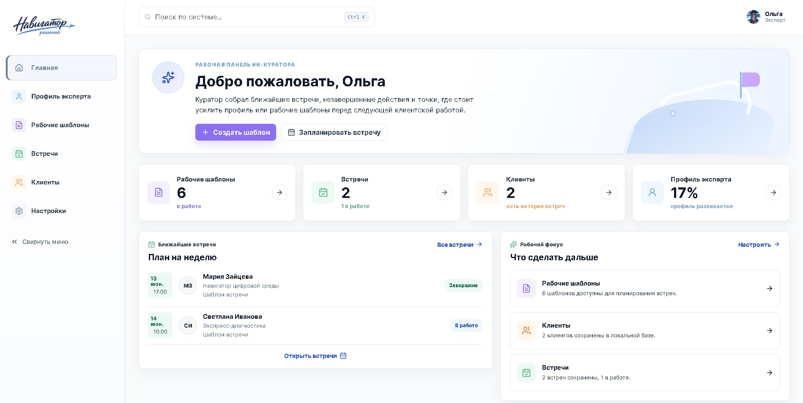

---

## Профиль эксперта

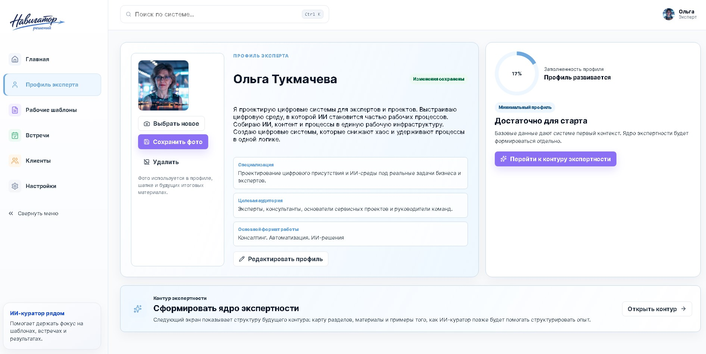

---

## ИИ-куратор профиля эксперта

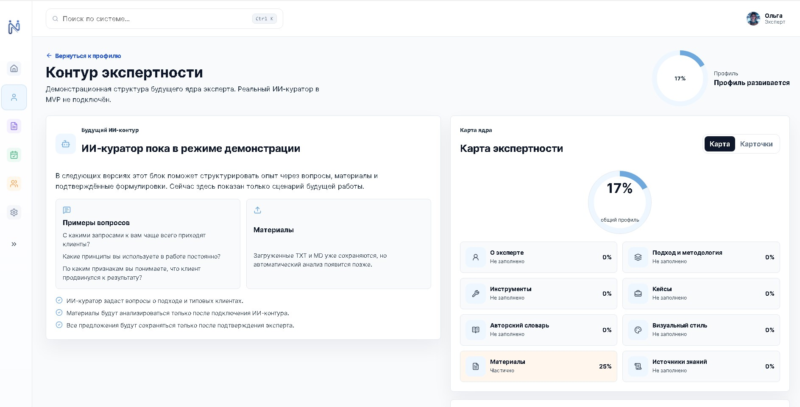

---

## Рабочие шаблоны

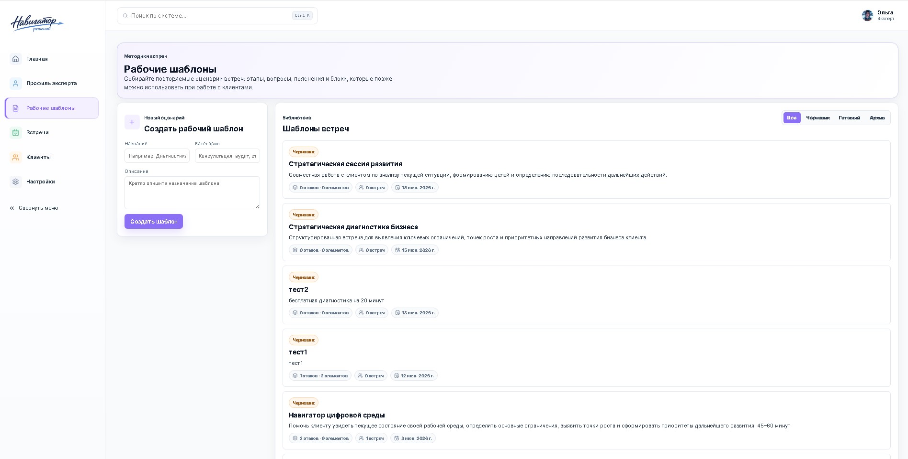

---

## Создание шаблона с помощью ИИ-куратора

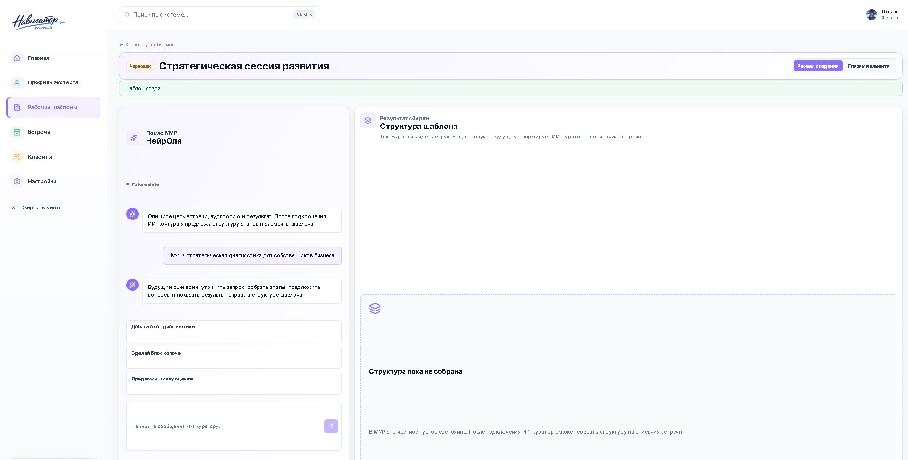

---

## Клиенты

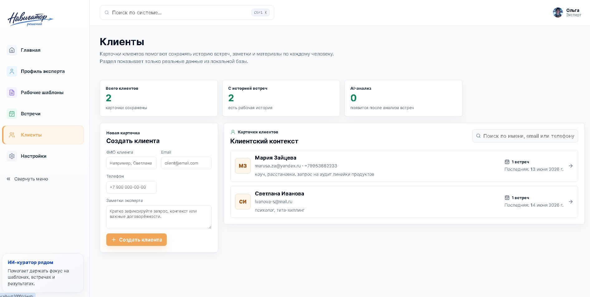

---

## Карточка клиента

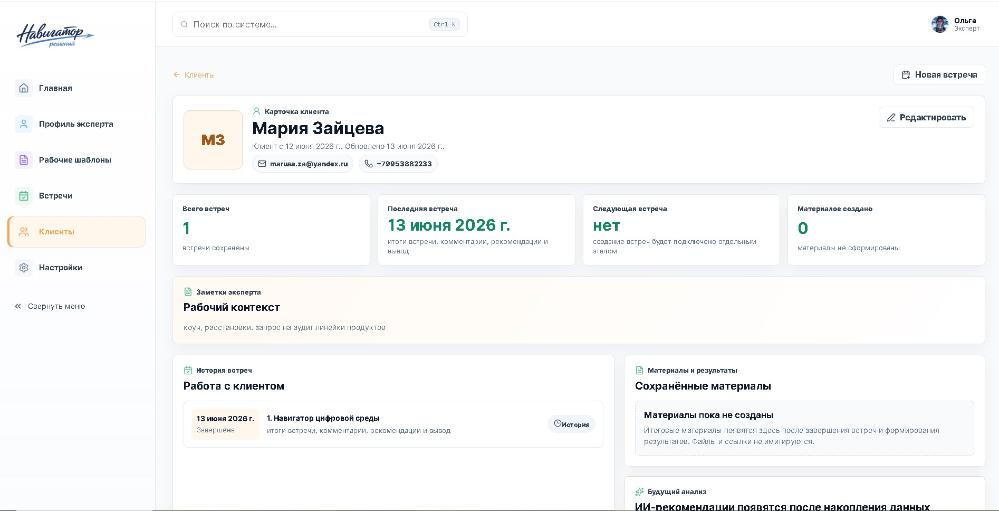

---

## Список встреч

---

## Рабочее пространство встречи

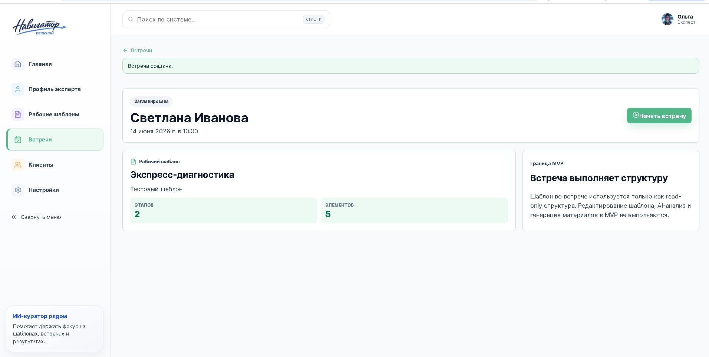

---

## Настройки системы

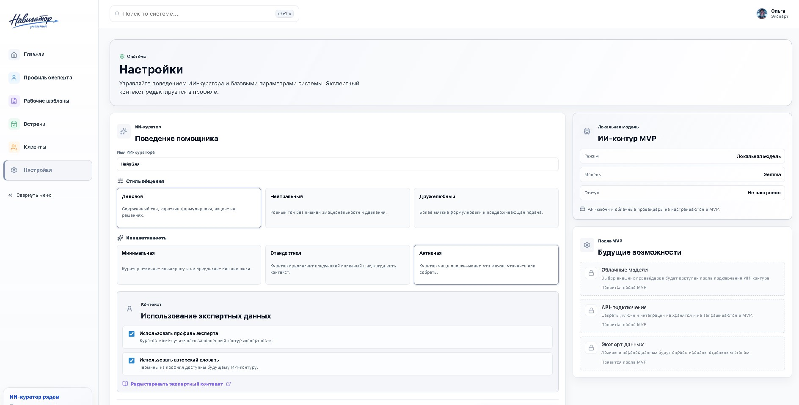

---

# Архитектурные схемы

## Общая концепция платформы

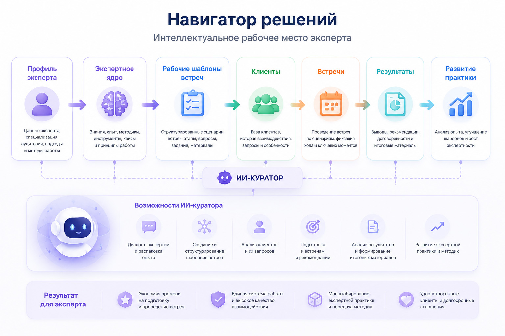

---

## Как опыт превращается в систему

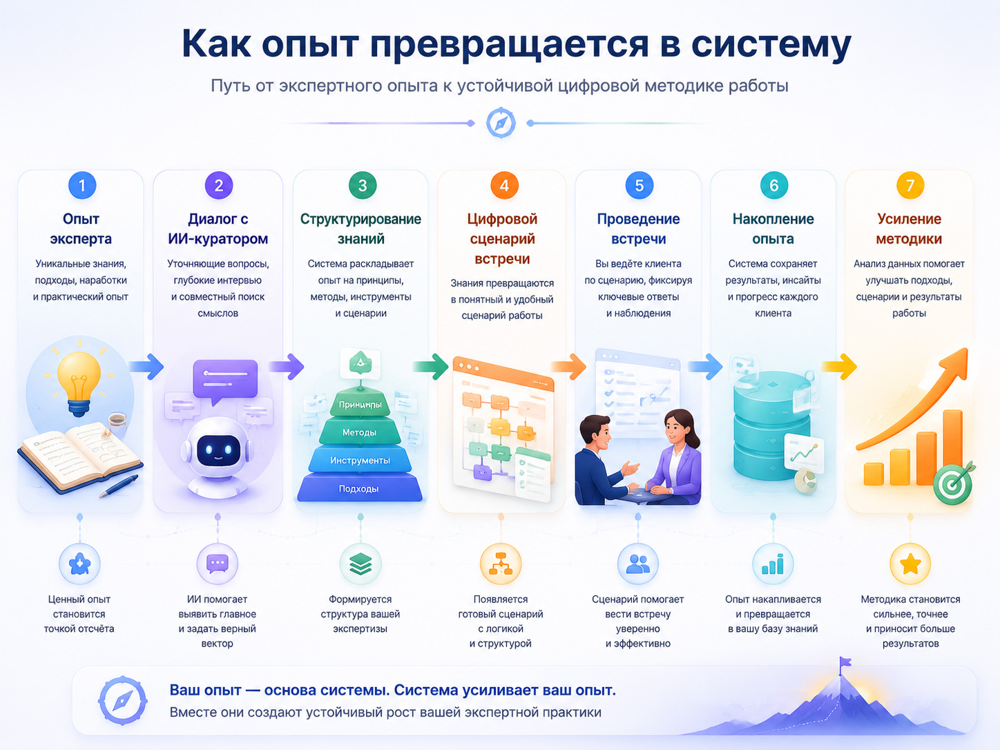

---

## Архитектура ИИ-оркестрации

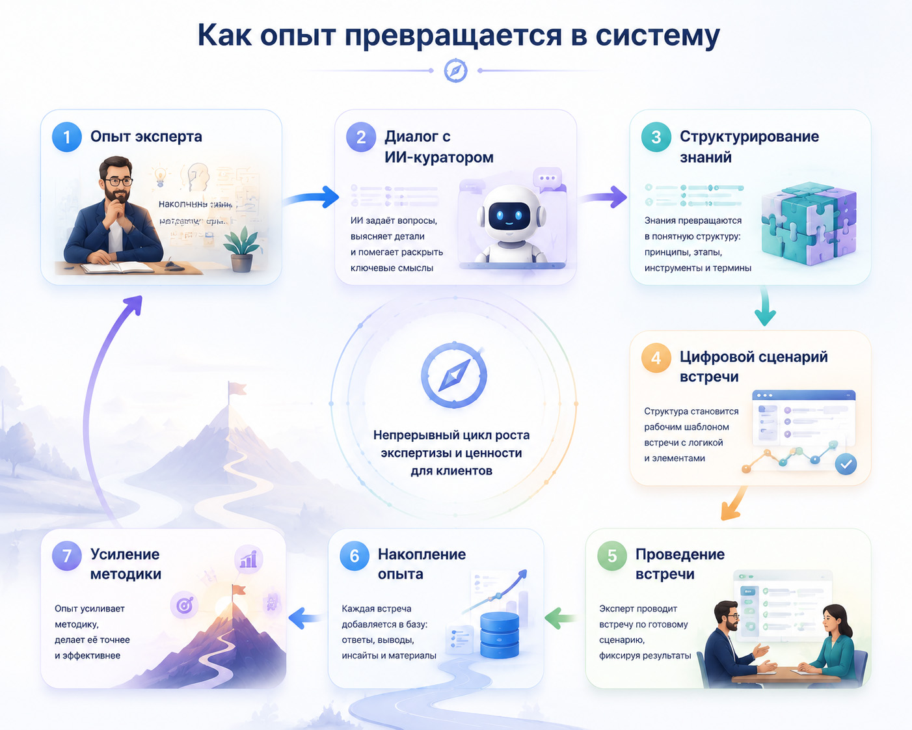

---

# Технологический стек

### Frontend

- Next.js
- React
- TypeScript
- Tailwind CSS

### Backend

- Next.js API Routes

### База данных

- SQLite

### ORM

- Prisma

### AI Layer

- Ollama
- Gemma 4
- AI Curator Architecture (MVP Design)

### Хранение данных

- Execution Engine
- Expert Knowledge Core
- Client Layer
- Meeting Layer

---

# ИИ-контур

В рамках MVP полностью спроектирована архитектура ИИ-куратора.

ИИ-куратор рассматривается как оркестратор системы, который управляет сценариями работы между различными контекстами:

- экспертное ядро
- проектирование шаблонов встреч
- подготовка к встрече
- анализ результатов встреч

Архитектура предусматривает использование субагентов, навыков (skills) и единого слоя исполнения задач.

---

# Статус проекта

### Реализовано

- пользовательский интерфейс системы
- основные пользовательские сценарии
- управление шаблонами встреч
- работа с клиентами
- проведение встреч
- сохранение данных
- архитектура ИИ-контура

### В работе

- подключение локальной модели через Ollama
- запуск ИИ-куратора
- автоматический анализ встреч
- генерация материалов и рекомендаций

Во время финального тестирования локальной модели Gemma возникла техническая ошибка загрузки модели через Ollama.

По этой причине подключение ИИ-контура вынесено в следующий этап развития проекта после завершения MVP.

---

## Автор

Ольга Тукмачева

Выпускной проект по направлению Vibe Coding / AI Product Development.
