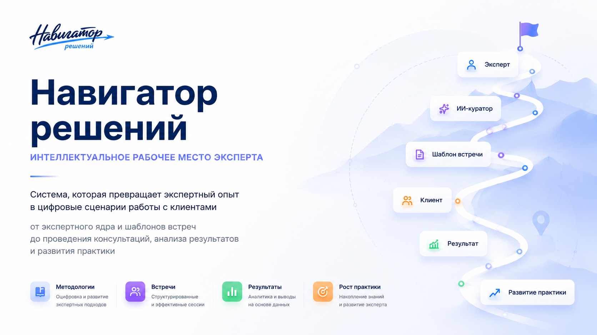

# Навигатор решений

  

  
  
  
  

<h3 align="center">
Интеллектуальное рабочее пространство эксперта
</h3>

Система для создания, проведения и анализа клиентских встреч на основе цифровых сценариев работы.

---

## Содержание

- [Статус проекта](#статус-проекта)
- [Проблема](#проблема)
- [Решение](#решение)
- [Основные возможности MVP](#основные-возможности-mvp)
- [Что реализовано](#что-реализовано)
- [Что находится в работе](#что-находится-в-работе)
- [Архитектура системы](#архитектура-системы)
- [Жизненный цикл встречи](#жизненный-цикл-встречи)
- [ИИ-контур](#ии-контур)
- [Карта развития ИИ-контура](#карта-развития-ии-контура)
- [Скриншоты системы](#скриншоты-системы)
- [Долгосрочное развитие платформы](#долгосрочное-развитие-платформы)
- [Технологии](#технологии)
- [Локальный запуск](#локальный-запуск)
- [Автор](#автор)

---

## Статус проекта

Проект реализован в формате MVP.

На текущем этапе полностью собран пользовательский интерфейс системы, реализованы основные разделы приложения и пользовательские сценарии работы с экспертным профилем, шаблонами встреч, клиентами, встречами и результатами.

Спроектирован ИИ-контур системы, определены точки интеграции ИИ-куратора, подготовлена архитектура его поэтапного внедрения и разработана дорожная карта дальнейшего развития интеллектуальных функций платформы.

---

## Проблема

Многие эксперты проводят десятки и сотни встреч, но их опыт остаётся только в голове. В работе используются документы, заметки, таблицы, презентации и другие разрозненные инструменты, которые не формируют единую систему работы.

Дополнительная сложность заключается в том, что эксперты часто называют разные виды встреч одинаково: консультация, диагностика, разбор. При этом фактически это могут быть разные форматы работы: аудит, стратегическая сессия, распаковка, диагностика или сопровождение.

В результате методика проведения встреч не фиксируется, не развивается и не может быть использована повторно без постоянного участия самого эксперта.

---

## Решение

Навигатор решений создаётся как интеллектуальное рабочее пространство эксперта, в котором профессиональный опыт постепенно превращается в цифровую систему работы с клиентами.

Основой системы являются рабочие шаблоны встреч. Каждый шаблон хранит структуру проведения встречи, её этапы, последовательность работы и результаты.

В дальнейшем формирование и развитие шаблонов будет происходить через диалог с ИИ-куратором, который помогает эксперту структурировать свой опыт и превращать его в рабочие цифровые сценарии.

---

## Основные возможности MVP

<table>
<tr>
<td width="50%" valign="top">

### Профиль эксперта

Раздел предназначен для хранения базовой информации об эксперте, его специализации, направлениях работы и особенностях практики.

Текущая версия содержит минимальный набор данных, необходимый для дальнейшего развития ИИ-контура и формирования экспертного ядра.

</td>
<td width="50%" valign="top">

### Рабочие шаблоны встреч

Центральный раздел системы.

Шаблоны используются для хранения структуры встреч и позволяют использовать единый подход в работе с клиентами.

В текущем MVP реализован интерфейс управления шаблонами и их место в общей архитектуре системы.

</td>
</tr>

<tr>
<td width="50%" valign="top">

### Клиенты

Раздел предназначен для хранения информации о клиентах и истории взаимодействия с ними.

Система связывает клиентов с конкретными встречами и результатами работы.

</td>
<td width="50%" valign="top">

### Встречи

Рабочий раздел системы, в котором эксперт проводит встречи на основе выбранного шаблона.

Каждая встреча связывается с клиентом и позволяет фиксировать ответы, заметки и результаты работы.

</td>
</tr>

<tr>
<td width="50%" valign="top">

### Результаты встреч

Раздел предназначен для сохранения итогов проведённой встречи.

В текущем MVP реализовано сохранение результатов работы.

Автоматическое формирование рекомендаций и аналитики планируется в рамках развития ИИ-контура.

</td>
<td width="50%" valign="top">

### Настройки

Раздел используется для управления параметрами системы и будущими настройками работы ИИ-куратора.

</td>
</tr>
</table>

---

## Что реализовано

- полностью собран пользовательский интерфейс
- профиль эксперта
- рабочие шаблоны встреч
- управление клиентами
- проведение встреч
- сохранение результатов встреч
- настройки системы
- пользовательские сценарии работы
- архитектура ИИ-контура
- карта развития ИИ-контура

---

## Что находится в работе

- подключение интеллектуального контура системы
- интеграция локальной языковой модели
- реализация первого этапа работы ИИ-куратора

---

## Архитектура системы

Система построена как единое рабочее пространство эксперта и включает следующие основные сущности:

- профиль эксперта
- шаблоны встреч
- клиенты
- встречи
- результаты встреч

Все разделы связаны между собой и формируют единый цикл работы с клиентом.

  

  

---

## Жизненный цикл встречи

Работа с клиентом строится по единому сценарию:

Клиент → Подготовка → Проведение встречи → Фиксация результатов → Рекомендации → Накопление практики → Улучшение шаблонов

Такой подход позволяет постепенно превращать опыт эксперта в развивающуюся систему.

  

---

## ИИ-контур

ИИ-контур является ключевым направлением развития системы.

Для MVP полностью спроектирована архитектура интеллектуального слоя, определены точки интеграции и подготовлена карта поэтапного подключения функциональности.

Цель ИИ-контура — помочь эксперту структурировать опыт, создавать рабочие шаблоны встреч, анализировать результаты работы и развивать собственную практику.

  

  

---

## Карта развития ИИ-контура

Этап 1 — Создание шаблонов встреч через ИИ-куратора

Этап 2 — Формирование результатов встреч

Этап 3 — Распаковка эксперта и развитие экспертного ядра

Этап 4 — Анализ клиентов

Этап 5 — Подготовка к встречам

Этап 6 — Развитие экспертной практики

Этап 7 — Визуализация встреч и результатов

Этап 8 — Масштабирование методик и командная работа

Этап 9 — Цифровая экосистема эксперта

  

---

## Скриншоты системы

### Главный экран

  

### Профиль эксперта

  

### Рабочие шаблоны

  

### Клиенты

  

### Встречи

  

### Результат встречи

  

### Настройки

  

---

## Долгосрочное развитие платформы

Помимо развития ИИ-контура, проект предусматривает дальнейшее расширение возможностей системы.

Планируемые направления развития:

- развитие экспертного ядра
- визуальное сопровождение встреч
- автоматическое оформление результатов работы
- цифровая упаковка эксперта
- персональные страницы и мини-сайты
- ИИ-консультанты
- квизы и лид-магниты
- маркетинговые инструменты
- маркетплейс методик и шаблонов встреч
- командная работа и передача методик между специалистами

---

## Технологии

  
  
  
  
  
  

### Frontend

- Next.js 14 App Router
- React 18
- TypeScript

### Backend

- Next.js Server Actions
- Server Components
- Prisma Client

### База данных

- SQLite
- Prisma ORM
- локальный файл базы данных: `prisma/dev.db`
- строка подключения: `DATABASE_URL="file:./dev.db"`

### Интерфейс и стилизация

- `lucide-react` для иконок
- глобальный CSS: `app/globals.css`
- CSS-переменные
- кастомные классы
- отдельная UI-библиотека не используется
- Tailwind CSS не используется

### Управление состоянием

- локальное состояние React: `useState`, `useEffect`, `useMemo`
- серверное состояние хранится в SQLite через Prisma
- внешние state manager библиотеки не используются

### ИИ-контур

- в настройках проекта зафиксирована локальная модель: `Gemma`
- провайдер: `local`
- текущий статус по умолчанию: `not_configured`
- runtime-подключение к модели находится в работе

---

## Локальный запуск

Проект запускается локально.

Для демонстрации подготовлены рабочие сценарии использования и полный комплект скриншотов интерфейса.

---

## Автор

Ольга Тукмачева

Проект разработан в рамках выпускного проекта курса по вайб-кодингу как MVP интеллектуального рабочего пространства эксперта.
